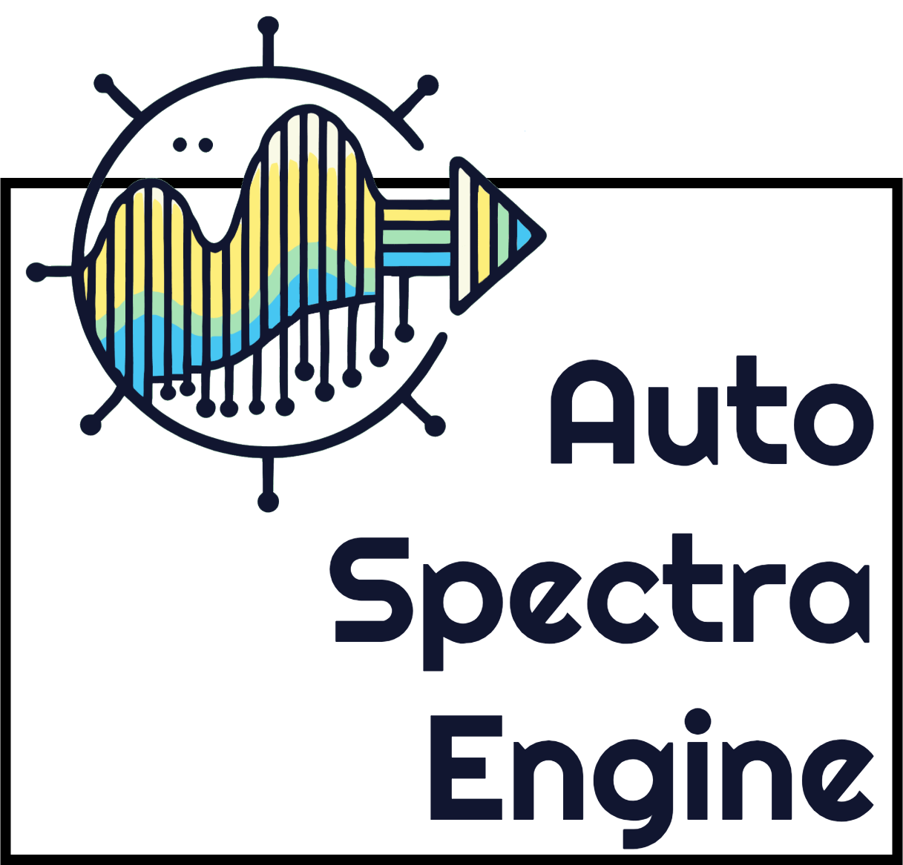

# AutoSpectraEngine

<p align="center">
  
</p>

AutoSpectraEngine is a Python-based platform developed by the Laboratory of Food Innovation (LINA) at the University of Campinas and the Machine Learning Lab at the University of Trieste. It is designed for the analysis of Near-Infrared (NIR) and Raman spectral data. The platform addresses critical challenges in spectral analysis, including preprocessing, spectral window optimization, and model hyperparameter tuning, all while automating the entire pipeline.

## Features

### Core Preprocessing Functions
1. **Mean Centering (MC)** - Center spectral data by subtracting the mean of each variable.
2. **Autoscaling** - Normalize data using z-score normalization.
3. **Smoothing (SMO)** - Apply Savitzky-Golay filters for noise reduction.
4. **First Derivative (D1)** - Compute the first derivative of spectral data for baseline correction.
5. **Second Derivative (D2)** - Compute the second derivative for resolving overlapping peaks.
6. **Multiplicative Scatter Correction (MSC)** - Reduce scattering effects in spectral data.
7. **Standard Normal Variate (SNV)** - Normalize data to eliminate scatter effects.

### Outlier Detection
- **Isolation Forest**: Detect and remove outliers from spectral datasets.

### Automated Pipeline Testing
- Perform experiments with over 70 unique preprocessing pipeline combinations.
- Flexibility to test pipelines tailored for NIR or Raman data.

### Modeling and Analysis
- **PCA Visualization**: Visualize spectral data distribution in reduced dimensionality.
- **PLSR (Partial Least Squares Regression)**: Evaluate model performance using metrics such as RMSE, RPD, and \( R^2 \).
- **PLS-DA (Partial Least Squares Discriminant Analysis)**: Assess classification accuracy and optimal latent variables.
- **Random Forest (RF)**: Evaluate classification performance using sensitivity and specificity.
- **One-Class PLS**: For one-class classification problems.
- **DDSIMCA**: A robust classification method for discriminant analysis.

### Predefined Spectra pipeline

- **NIR**
- **eNose**
- **Raman**

## Installation

Clone the repository and install dependencies:

```bash
git clone https://github.com/sbarbonjr/AutoSpectraEngine.git
cd AutoSpectraEngine
pip install -r requirements.txt
```

## Running Experiments

### Input CSV File Structure

To use **AutoSpectraEngine**, your input CSV file should follow this structure:

1. **Header Row**: The first row should contain column headers:
   - The headers should represent the **wavelengths** (e.g., `500`, `501`, `502`, etc.).
   - Additional columns can include **target values** for classification or regression tasks.

2. **Sample Rows**:
   - Each row corresponds to a single sample.
   - The columns (under the wavelength headers) contain the **spectral data values** for that sample.

3. **Target Columns**:
   - The file can include one or more additional columns that represent the **expected target values** for classification or regression tasks.
   - These target columns can be placed either **before or after the spectral data columns**.

### Example CSV File

Here’s an example of a valid CSV file structure:

| 500   | 501   | 502   | 503   | Class | Concentration |
|-------|--------|--------|--------|-------|---------------|
| 0.123 | 0.456  | 0.789  | 0.101  | A     | 12.5          |
| 0.321 | 0.654  | 0.987  | 0.202  | B     | 14.8          |
| 0.231 | 0.564  | 0.897  | 0.303  | A     | 13.2          |

### Key Points to Remember
- **Spectral Data**: Columns representing the spectral wavelengths must contain numeric and continuous data.
- **Target Columns**:
  - For **classification tasks**, target columns (e.g., `Class`) should contain categorical values.
  - For **regression tasks**, target columns (e.g., `Concentration`) should contain numeric values.
- **Empty or Missing Values**: Ensure there are no missing or empty cells in the spectral or target columns.

Following this structure ensures compatibility with **AutoSpectraEngine**'s preprocessing and analysis capabilities.

## Calling the Experimentation

Use the run_all_experiments function to automate pipeline testing and model evaluation:

```bash
from auto_spectra_engine import run_all_experiments

run_all_experiments(
    file="path/to/data.csv",
    modelo="PLSDA", 
    coluna_predicao="Class",
    test_contamination=True,
    pipeline_family='all'
)
```